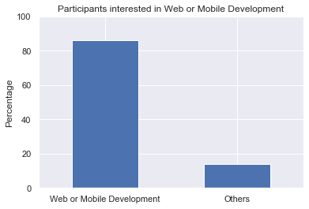

```python
import numpy as np
import pandas as pd
import matplotlib.pyplot as plt
%matplotlib inline
import seaborn as sns

```

For the purpose of our analysis, we want to answer questions about a population of new coders that are interested in the subjects we teach. We'd like to know:

1. Where are these new coders located.
2. What are the locations with the greatest number of new coders.
3. How much money new coders are willing to spend on learning.

# Obtaining the data

1. input data from '2017-fCC-New-Coders-Survey-Data.csv'
2. output data as market_survey


```python
market_survey=pd.read_csv('2017-fCC-New-Coders-Survey-Data.csv')  
```


```python
market_survey.describe()
```


<div>
<style scoped>
    .dataframe tbody tr th:only-of-type {
        vertical-align: middle;
    }

    .dataframe tbody tr th {
        vertical-align: top;
    }
    
    .dataframe thead th {
        text-align: right;
    }
</style>
<table border="1" class="dataframe">
  <thead>
    <tr style="text-align: right;">
      <th></th>
      <th>Age</th>
      <th>AttendedBootcamp</th>
      <th>BootcampFinish</th>
      <th>BootcampLoanYesNo</th>
      <th>BootcampRecommend</th>
      <th>ChildrenNumber</th>
      <th>CodeEventConferences</th>
      <th>CodeEventDjangoGirls</th>
      <th>CodeEventFCC</th>
      <th>CodeEventGameJam</th>
      <th>...</th>
      <th>YouTubeEngineeredTruth</th>
      <th>YouTubeFCC</th>
      <th>YouTubeFunFunFunction</th>
      <th>YouTubeGoogleDev</th>
      <th>YouTubeLearnCode</th>
      <th>YouTubeLevelUpTuts</th>
      <th>YouTubeMIT</th>
      <th>YouTubeMozillaHacks</th>
      <th>YouTubeSimplilearn</th>
      <th>YouTubeTheNewBoston</th>
    </tr>
  </thead>
  <tbody>
    <tr>
      <th>count</th>
      <td>15367.000000</td>
      <td>17709.000000</td>
      <td>1069.000000</td>
      <td>1079.000000</td>
      <td>1073.000000</td>
      <td>2314.000000</td>
      <td>1609.0</td>
      <td>165.0</td>
      <td>1708.0</td>
      <td>290.0</td>
      <td>...</td>
      <td>993.0</td>
      <td>6036.0</td>
      <td>1261.0</td>
      <td>3539.0</td>
      <td>2662.0</td>
      <td>1396.0</td>
      <td>3327.0</td>
      <td>622.0</td>
      <td>201.0</td>
      <td>2960.0</td>
    </tr>
    <tr>
      <th>mean</th>
      <td>27.691872</td>
      <td>0.062002</td>
      <td>0.699719</td>
      <td>0.305839</td>
      <td>0.818267</td>
      <td>1.832325</td>
      <td>1.0</td>
      <td>1.0</td>
      <td>1.0</td>
      <td>1.0</td>
      <td>...</td>
      <td>1.0</td>
      <td>1.0</td>
      <td>1.0</td>
      <td>1.0</td>
      <td>1.0</td>
      <td>1.0</td>
      <td>1.0</td>
      <td>1.0</td>
      <td>1.0</td>
      <td>1.0</td>
    </tr>
    <tr>
      <th>std</th>
      <td>8.559239</td>
      <td>0.241167</td>
      <td>0.458594</td>
      <td>0.460975</td>
      <td>0.385805</td>
      <td>0.972813</td>
      <td>0.0</td>
      <td>0.0</td>
      <td>0.0</td>
      <td>0.0</td>
      <td>...</td>
      <td>0.0</td>
      <td>0.0</td>
      <td>0.0</td>
      <td>0.0</td>
      <td>0.0</td>
      <td>0.0</td>
      <td>0.0</td>
      <td>0.0</td>
      <td>0.0</td>
      <td>0.0</td>
    </tr>
    <tr>
      <th>min</th>
      <td>0.000000</td>
      <td>0.000000</td>
      <td>0.000000</td>
      <td>0.000000</td>
      <td>0.000000</td>
      <td>1.000000</td>
      <td>1.0</td>
      <td>1.0</td>
      <td>1.0</td>
      <td>1.0</td>
      <td>...</td>
      <td>1.0</td>
      <td>1.0</td>
      <td>1.0</td>
      <td>1.0</td>
      <td>1.0</td>
      <td>1.0</td>
      <td>1.0</td>
      <td>1.0</td>
      <td>1.0</td>
      <td>1.0</td>
    </tr>
    <tr>
      <th>25%</th>
      <td>22.000000</td>
      <td>0.000000</td>
      <td>0.000000</td>
      <td>0.000000</td>
      <td>1.000000</td>
      <td>1.000000</td>
      <td>1.0</td>
      <td>1.0</td>
      <td>1.0</td>
      <td>1.0</td>
      <td>...</td>
      <td>1.0</td>
      <td>1.0</td>
      <td>1.0</td>
      <td>1.0</td>
      <td>1.0</td>
      <td>1.0</td>
      <td>1.0</td>
      <td>1.0</td>
      <td>1.0</td>
      <td>1.0</td>
    </tr>
    <tr>
      <th>50%</th>
      <td>26.000000</td>
      <td>0.000000</td>
      <td>1.000000</td>
      <td>0.000000</td>
      <td>1.000000</td>
      <td>2.000000</td>
      <td>1.0</td>
      <td>1.0</td>
      <td>1.0</td>
      <td>1.0</td>
      <td>...</td>
      <td>1.0</td>
      <td>1.0</td>
      <td>1.0</td>
      <td>1.0</td>
      <td>1.0</td>
      <td>1.0</td>
      <td>1.0</td>
      <td>1.0</td>
      <td>1.0</td>
      <td>1.0</td>
    </tr>
    <tr>
      <th>75%</th>
      <td>32.000000</td>
      <td>0.000000</td>
      <td>1.000000</td>
      <td>1.000000</td>
      <td>1.000000</td>
      <td>2.000000</td>
      <td>1.0</td>
      <td>1.0</td>
      <td>1.0</td>
      <td>1.0</td>
      <td>...</td>
      <td>1.0</td>
      <td>1.0</td>
      <td>1.0</td>
      <td>1.0</td>
      <td>1.0</td>
      <td>1.0</td>
      <td>1.0</td>
      <td>1.0</td>
      <td>1.0</td>
      <td>1.0</td>
    </tr>
    <tr>
      <th>max</th>
      <td>90.000000</td>
      <td>1.000000</td>
      <td>1.000000</td>
      <td>1.000000</td>
      <td>1.000000</td>
      <td>9.000000</td>
      <td>1.0</td>
      <td>1.0</td>
      <td>1.0</td>
      <td>1.0</td>
      <td>...</td>
      <td>1.0</td>
      <td>1.0</td>
      <td>1.0</td>
      <td>1.0</td>
      <td>1.0</td>
      <td>1.0</td>
      <td>1.0</td>
      <td>1.0</td>
      <td>1.0</td>
      <td>1.0</td>
    </tr>
  </tbody>
</table>
<p>8 rows × 105 columns</p>
</div>


```python
market_survey.head(5)
```


<div>
<style scoped>
    .dataframe tbody tr th:only-of-type {
        vertical-align: middle;
    }

    .dataframe tbody tr th {
        vertical-align: top;
    }
    
    .dataframe thead th {
        text-align: right;
    }
</style>
<table border="1" class="dataframe">
  <thead>
    <tr style="text-align: right;">
      <th></th>
      <th>Age</th>
      <th>AttendedBootcamp</th>
      <th>BootcampFinish</th>
      <th>BootcampLoanYesNo</th>
      <th>BootcampName</th>
      <th>BootcampRecommend</th>
      <th>ChildrenNumber</th>
      <th>CityPopulation</th>
      <th>CodeEventConferences</th>
      <th>CodeEventDjangoGirls</th>
      <th>...</th>
      <th>YouTubeFCC</th>
      <th>YouTubeFunFunFunction</th>
      <th>YouTubeGoogleDev</th>
      <th>YouTubeLearnCode</th>
      <th>YouTubeLevelUpTuts</th>
      <th>YouTubeMIT</th>
      <th>YouTubeMozillaHacks</th>
      <th>YouTubeOther</th>
      <th>YouTubeSimplilearn</th>
      <th>YouTubeTheNewBoston</th>
    </tr>
  </thead>
  <tbody>
    <tr>
      <th>0</th>
      <td>27.0</td>
      <td>0.0</td>
      <td>NaN</td>
      <td>NaN</td>
      <td>NaN</td>
      <td>NaN</td>
      <td>NaN</td>
      <td>more than 1 million</td>
      <td>NaN</td>
      <td>NaN</td>
      <td>...</td>
      <td>NaN</td>
      <td>NaN</td>
      <td>NaN</td>
      <td>NaN</td>
      <td>NaN</td>
      <td>NaN</td>
      <td>NaN</td>
      <td>NaN</td>
      <td>NaN</td>
      <td>NaN</td>
    </tr>
    <tr>
      <th>1</th>
      <td>34.0</td>
      <td>0.0</td>
      <td>NaN</td>
      <td>NaN</td>
      <td>NaN</td>
      <td>NaN</td>
      <td>NaN</td>
      <td>less than 100,000</td>
      <td>NaN</td>
      <td>NaN</td>
      <td>...</td>
      <td>1.0</td>
      <td>NaN</td>
      <td>NaN</td>
      <td>NaN</td>
      <td>NaN</td>
      <td>NaN</td>
      <td>NaN</td>
      <td>NaN</td>
      <td>NaN</td>
      <td>NaN</td>
    </tr>
    <tr>
      <th>2</th>
      <td>21.0</td>
      <td>0.0</td>
      <td>NaN</td>
      <td>NaN</td>
      <td>NaN</td>
      <td>NaN</td>
      <td>NaN</td>
      <td>more than 1 million</td>
      <td>NaN</td>
      <td>NaN</td>
      <td>...</td>
      <td>NaN</td>
      <td>NaN</td>
      <td>NaN</td>
      <td>1.0</td>
      <td>1.0</td>
      <td>NaN</td>
      <td>NaN</td>
      <td>NaN</td>
      <td>NaN</td>
      <td>NaN</td>
    </tr>
    <tr>
      <th>3</th>
      <td>26.0</td>
      <td>0.0</td>
      <td>NaN</td>
      <td>NaN</td>
      <td>NaN</td>
      <td>NaN</td>
      <td>NaN</td>
      <td>between 100,000 and 1 million</td>
      <td>NaN</td>
      <td>NaN</td>
      <td>...</td>
      <td>1.0</td>
      <td>1.0</td>
      <td>NaN</td>
      <td>NaN</td>
      <td>1.0</td>
      <td>NaN</td>
      <td>NaN</td>
      <td>NaN</td>
      <td>NaN</td>
      <td>NaN</td>
    </tr>
    <tr>
      <th>4</th>
      <td>20.0</td>
      <td>0.0</td>
      <td>NaN</td>
      <td>NaN</td>
      <td>NaN</td>
      <td>NaN</td>
      <td>NaN</td>
      <td>between 100,000 and 1 million</td>
      <td>NaN</td>
      <td>NaN</td>
      <td>...</td>
      <td>NaN</td>
      <td>NaN</td>
      <td>NaN</td>
      <td>NaN</td>
      <td>NaN</td>
      <td>NaN</td>
      <td>NaN</td>
      <td>NaN</td>
      <td>NaN</td>
      <td>NaN</td>
    </tr>
  </tbody>
</table>
<p>5 rows × 136 columns</p>
</div>


```python
market_survey.columns
```


    Index(['Age', 'AttendedBootcamp', 'BootcampFinish', 'BootcampLoanYesNo',
           'BootcampName', 'BootcampRecommend', 'ChildrenNumber', 'CityPopulation',
           'CodeEventConferences', 'CodeEventDjangoGirls',
           ...
           'YouTubeFCC', 'YouTubeFunFunFunction', 'YouTubeGoogleDev',
           'YouTubeLearnCode', 'YouTubeLevelUpTuts', 'YouTubeMIT',
           'YouTubeMozillaHacks', 'YouTubeOther', 'YouTubeSimplilearn',
           'YouTubeTheNewBoston'],
          dtype='object', length=136)


## Let us focus on the column 'JobRoleInterest'

1. The JobRoleInterest column describes for every participant the role(s) they'd be interested in working.
2. Generate a frequency distribution table for this column. Take percentages instead of absolute frequencies.Analyze the table.
    1. Are people interested in only one subject or they can be interested in more than one subject?
    2. If most people are interested in more than one subject, is this sample still representative?
    3. The focus of our courses is on web and mobile development. How many people are interested in at least one of these two subjects?


```python
market_survey['JobRoleInterest'].value_counts(normalize=True,dropna=True)*100
```


    Full-Stack Web Developer                                                                                                           11.770595
      Front-End Web Developer                                                                                                           6.435927
      Data Scientist                                                                                                                    2.173913
    Back-End Web Developer                                                                                                              2.030892
      Mobile Developer                                                                                                                  1.673341
                                                                                                                                         ...    
    Data Engineer,   Mobile Developer, Full-Stack Web Developer, Back-End Web Developer,   Front-End Web Developer                      0.014302
    Back-End Web Developer,   Data Scientist, Full-Stack Web Developer, Data Engineer,   Quality Assurance Engineer, Game Developer     0.014302
    Game Developer,   Quality Assurance Engineer, Back-End Web Developer,   Front-End Web Developer                                     0.014302
    Data Engineer, Full-Stack Web Developer, Back-End Web Developer,   Mobile Developer                                                 0.014302
      Front-End Web Developer, Full-Stack Web Developer, programmer                                                                     0.014302
    Name: JobRoleInterest, Length: 3213, dtype: float64


```python
job_role_interest=market_survey['JobRoleInterest'].dropna()
interest_more_than_one=job_role_interest.str.split(',')

```


```python
interest_more_than_one_count=interest_more_than_one.apply(lambda x: len(x))

interest_more_than_one_count

```


    1         1
    2         5
    3         3
    4         5
    6         1
             ..
    18161     1
    18162     3
    18163     4
    18171    13
    18174     3
    Name: JobRoleInterest, Length: 6992, dtype: int64


```python
interest_more_than_one_count.value_counts(normalize=True,dropna=True).sort_index()*100
```


    1     31.650458
    2     10.883867
    3     15.889588
    4     15.217391
    5     12.042334
    6      6.721968
    7      3.861556
    8      1.759153
    9      0.986842
    10     0.471968
    11     0.185927
    12     0.300343
    13     0.028604
    Name: JobRoleInterest, dtype: float64


```python
##The focus of our courses is on web and mobile development. How many people are interested in at least one of these two subjects?

web_or_mobile = market_survey_clear.str.contains('Web Developer|Mobile Developer')
table = web_or_mobile .value_counts(normalize = True) * 100
table

table.plot.bar()
plt.title('Participants interested in Web or Mobile Development')
plt.ylabel('Percentage', fontsize = 12)
plt.xticks([0, 1], ['Web or Mobile Development', 'Others'], rotation = 0)
plt.ylim([0, 100])
plt.show()
```





### Now that we found out that the sample has the right categories of people

1. We can start with finding out where these new coders are located, and what are the densities (how many coderes there are) for each location.
2. We are working with the 'CountryLive' variable because we're interested where people actually live at the moment when we run the ads.


```python
market_survey['CountryLive'].describe()

```


    count                        15336
    unique                         172
    top       United States of America
    freq                          5791
    Name: CountryLive, dtype: object


```python
##filter out the data without 'JobRoleInterest'

market_survey_jobs_clear=market_survey[market_survey['JobRoleInterest'].notnull()]
relative_frequencies=market_survey_jobs_clear['CountryLive'].value_counts()
abs_frequencies=market_survey_jobs_clear['CountryLive'].value_counts(normalize=True)*100
Frq_table=pd.DataFrame(data= {'Abs_Frq':relative_frequencies, 'Percentage':abs_frequencies})
Frq_table
```


<div>
<style scoped>
    .dataframe tbody tr th:only-of-type {
        vertical-align: middle;
    }

    .dataframe tbody tr th {
        vertical-align: top;
    }
    
    .dataframe thead th {
        text-align: right;
    }
</style>
<table border="1" class="dataframe">
  <thead>
    <tr style="text-align: right;">
      <th></th>
      <th>Abs_Frq</th>
      <th>Percentage</th>
    </tr>
  </thead>
  <tbody>
    <tr>
      <th>United States of America</th>
      <td>3125</td>
      <td>45.700497</td>
    </tr>
    <tr>
      <th>India</th>
      <td>528</td>
      <td>7.721556</td>
    </tr>
    <tr>
      <th>United Kingdom</th>
      <td>315</td>
      <td>4.606610</td>
    </tr>
    <tr>
      <th>Canada</th>
      <td>260</td>
      <td>3.802281</td>
    </tr>
    <tr>
      <th>Poland</th>
      <td>131</td>
      <td>1.915765</td>
    </tr>
    <tr>
      <th>Brazil</th>
      <td>129</td>
      <td>1.886517</td>
    </tr>
    <tr>
      <th>Germany</th>
      <td>125</td>
      <td>1.828020</td>
    </tr>
    <tr>
      <th>Australia</th>
      <td>112</td>
      <td>1.637906</td>
    </tr>
    <tr>
      <th>Russia</th>
      <td>102</td>
      <td>1.491664</td>
    </tr>
    <tr>
      <th>Ukraine</th>
      <td>89</td>
      <td>1.301550</td>
    </tr>
    <tr>
      <th>Nigeria</th>
      <td>84</td>
      <td>1.228429</td>
    </tr>
    <tr>
      <th>Spain</th>
      <td>77</td>
      <td>1.126060</td>
    </tr>
    <tr>
      <th>France</th>
      <td>75</td>
      <td>1.096812</td>
    </tr>
    <tr>
      <th>Romania</th>
      <td>71</td>
      <td>1.038315</td>
    </tr>
    <tr>
      <th>Netherlands (Holland, Europe)</th>
      <td>65</td>
      <td>0.950570</td>
    </tr>
    <tr>
      <th>Italy</th>
      <td>62</td>
      <td>0.906698</td>
    </tr>
    <tr>
      <th>Philippines</th>
      <td>52</td>
      <td>0.760456</td>
    </tr>
    <tr>
      <th>Serbia</th>
      <td>52</td>
      <td>0.760456</td>
    </tr>
    <tr>
      <th>Greece</th>
      <td>46</td>
      <td>0.672711</td>
    </tr>
    <tr>
      <th>Ireland</th>
      <td>43</td>
      <td>0.628839</td>
    </tr>
    <tr>
      <th>South Africa</th>
      <td>39</td>
      <td>0.570342</td>
    </tr>
    <tr>
      <th>Mexico</th>
      <td>37</td>
      <td>0.541094</td>
    </tr>
    <tr>
      <th>Turkey</th>
      <td>36</td>
      <td>0.526470</td>
    </tr>
    <tr>
      <th>Hungary</th>
      <td>34</td>
      <td>0.497221</td>
    </tr>
    <tr>
      <th>Singapore</th>
      <td>34</td>
      <td>0.497221</td>
    </tr>
    <tr>
      <th>New Zealand</th>
      <td>33</td>
      <td>0.482597</td>
    </tr>
    <tr>
      <th>Croatia</th>
      <td>32</td>
      <td>0.467973</td>
    </tr>
    <tr>
      <th>Argentina</th>
      <td>32</td>
      <td>0.467973</td>
    </tr>
    <tr>
      <th>Norway</th>
      <td>31</td>
      <td>0.453349</td>
    </tr>
    <tr>
      <th>Sweden</th>
      <td>31</td>
      <td>0.453349</td>
    </tr>
    <tr>
      <th>...</th>
      <td>...</td>
      <td>...</td>
    </tr>
    <tr>
      <th>Guadeloupe</th>
      <td>1</td>
      <td>0.014624</td>
    </tr>
    <tr>
      <th>Nicaragua</th>
      <td>1</td>
      <td>0.014624</td>
    </tr>
    <tr>
      <th>Gibraltar</th>
      <td>1</td>
      <td>0.014624</td>
    </tr>
    <tr>
      <th>Nambia</th>
      <td>1</td>
      <td>0.014624</td>
    </tr>
    <tr>
      <th>Cuba</th>
      <td>1</td>
      <td>0.014624</td>
    </tr>
    <tr>
      <th>Aruba</th>
      <td>1</td>
      <td>0.014624</td>
    </tr>
    <tr>
      <th>Samoa</th>
      <td>1</td>
      <td>0.014624</td>
    </tr>
    <tr>
      <th>Bolivia</th>
      <td>1</td>
      <td>0.014624</td>
    </tr>
    <tr>
      <th>Turkmenistan</th>
      <td>1</td>
      <td>0.014624</td>
    </tr>
    <tr>
      <th>Panama</th>
      <td>1</td>
      <td>0.014624</td>
    </tr>
    <tr>
      <th>Guatemala</th>
      <td>1</td>
      <td>0.014624</td>
    </tr>
    <tr>
      <th>Angola</th>
      <td>1</td>
      <td>0.014624</td>
    </tr>
    <tr>
      <th>Qatar</th>
      <td>1</td>
      <td>0.014624</td>
    </tr>
    <tr>
      <th>Yemen</th>
      <td>1</td>
      <td>0.014624</td>
    </tr>
    <tr>
      <th>Somalia</th>
      <td>1</td>
      <td>0.014624</td>
    </tr>
    <tr>
      <th>Mozambique</th>
      <td>1</td>
      <td>0.014624</td>
    </tr>
    <tr>
      <th>Cameroon</th>
      <td>1</td>
      <td>0.014624</td>
    </tr>
    <tr>
      <th>Trinidad &amp; Tobago</th>
      <td>1</td>
      <td>0.014624</td>
    </tr>
    <tr>
      <th>Gambia</th>
      <td>1</td>
      <td>0.014624</td>
    </tr>
    <tr>
      <th>Kyrgyzstan</th>
      <td>1</td>
      <td>0.014624</td>
    </tr>
    <tr>
      <th>Rwanda</th>
      <td>1</td>
      <td>0.014624</td>
    </tr>
    <tr>
      <th>Botswana</th>
      <td>1</td>
      <td>0.014624</td>
    </tr>
    <tr>
      <th>Jordan</th>
      <td>1</td>
      <td>0.014624</td>
    </tr>
    <tr>
      <th>Cayman Islands</th>
      <td>1</td>
      <td>0.014624</td>
    </tr>
    <tr>
      <th>Channel Islands</th>
      <td>1</td>
      <td>0.014624</td>
    </tr>
    <tr>
      <th>Sudan</th>
      <td>1</td>
      <td>0.014624</td>
    </tr>
    <tr>
      <th>Myanmar</th>
      <td>1</td>
      <td>0.014624</td>
    </tr>
    <tr>
      <th>Papua New Guinea</th>
      <td>1</td>
      <td>0.014624</td>
    </tr>
    <tr>
      <th>Liberia</th>
      <td>1</td>
      <td>0.014624</td>
    </tr>
    <tr>
      <th>Vanuatu</th>
      <td>1</td>
      <td>0.014624</td>
    </tr>
  </tbody>
</table>
<p>137 rows × 2 columns</p>
</div>


```python
# sns.distplot(Frq_table['Percentage'])         
# plt.show()
```

##  Question：
1. Figuring out how much money new coders are actually willing to spend on learning. 
2. The 'MoneyForLearning' column describes in American dollars the amount of money spent by participants from the moment they started coding until the moment they completed the survey.


```python
market_survey_jobs_clear['MoneyForLearning'].describe()
```


    count      6476.00000
    mean        885.31223
    std        4893.37377
    min           0.00000
    25%           0.00000
    50%          10.00000
    75%         200.00000
    max      200000.00000
    Name: MoneyForLearning, dtype: float64


```python
market_survey_jobs_clear['MonthsProgramming'].describe()
market_survey_jobs_clear_1=market_survey_jobs_clear.copy()
```


```python
#### replace the data in 'MonthsProgramming' as 0 to 1
####drop the NA data
market_survey_jobs_clear_1['MonthsProgramming'].replace(0,1,inplace=True)
#market_survey_jobs_clear_1=market_survey_jobs_clear_1[market_survey_jobs_clear_1['MonthsProgramming'].notnull()]
#market_survey_jobs_clear_1=market_survey_jobs_clear_1[market_survey_jobs_clear_1['MoneyForLearning'].notnull()]
market_survey_jobs_clear_1['MonthsProgramming'].describe()
```


    count    6317.000000
    mean       13.463195
    std        28.591411
    min         1.000000
    25%         2.000000
    50%         6.000000
    75%        15.000000
    max       744.000000
    Name: MonthsProgramming, dtype: float64


```python
market_survey_jobs_clear_1['per_month_cost']=market_survey_jobs_clear_1['MoneyForLearning']/market_survey_jobs_clear_1['MonthsProgramming']
```


```python
market_survey_jobs_clear_2=market_survey_jobs_clear_1[market_survey_jobs_clear_1['per_month_cost'].notnull()]
market_survey_jobs_clear_2['per_month_cost'].describe()
#market_survey_jobs_clear_2['per_month_cost'].isnull().sum()

```


    count     6317.000000
    mean       177.468653
    std       1563.115242
    min          0.000000
    25%          0.000000
    50%          0.708333
    75%         33.333333
    max      80000.000000
    Name: per_month_cost, dtype: float64


### consider the countrylive vs per_month_cost
1. Remove also any rows that have null values in the CountryLive column.
2. Group the remaining data by the CountryLive column and find out how much money a student spends on average each month in the US, India, the United Kingdom and Canada.


```python
## Remove also any rows that have null values in the CountryLive column.
market_survey_jobs_clear_2=market_survey_jobs_clear_2[market_survey_jobs_clear_2['CountryLive'].notnull()]
market_survey_jobs_clear_2['CountryLive'].value_counts()
```


    United States of America    2933
    India                        463
    United Kingdom               279
    Canada                       240
    Poland                       122
                                ... 
    Myanmar                        1
    Angola                         1
    Samoa                          1
    Papua New Guinea               1
    Vanuatu                        1
    Name: CountryLive, Length: 131, dtype: int64


```python
country_live_mean=market_survey_jobs_clear_2.groupby(['CountryLive']).mean()
country_live_mean['per_month_cost'][['United States of America', 'India', 'United Kingdom', 'Canada']]


```


    CountryLive
    United States of America    227.997996
    India                       135.100982
    United Kingdom               45.534443
    Canada                      113.510961
    Name: per_month_cost, dtype: float64


```python

```
