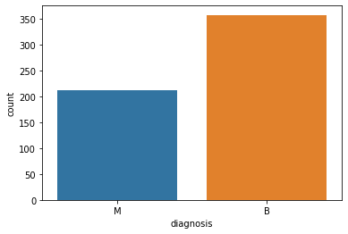
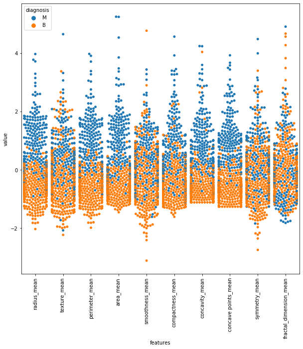
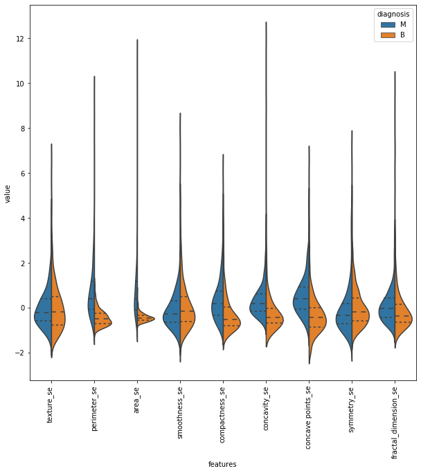
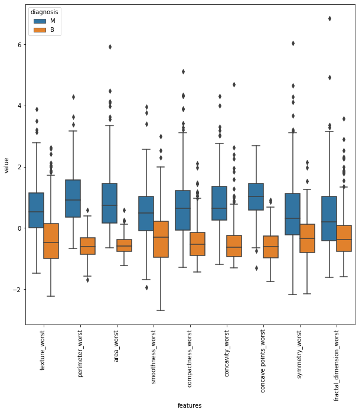
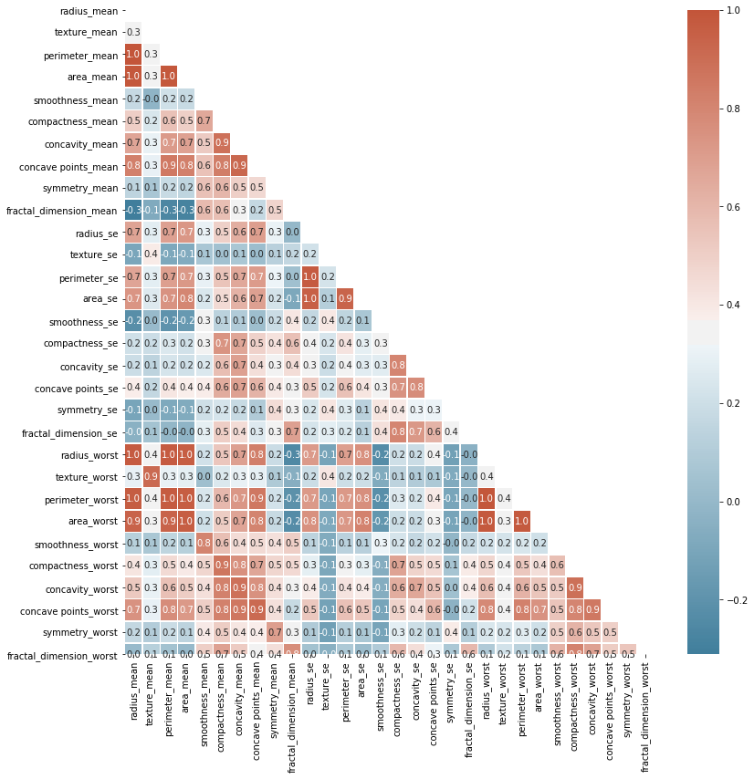
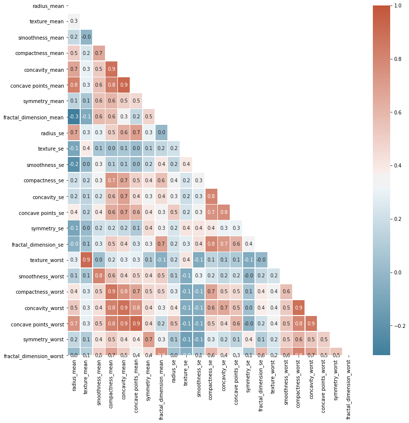
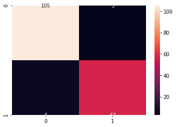
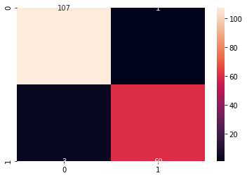
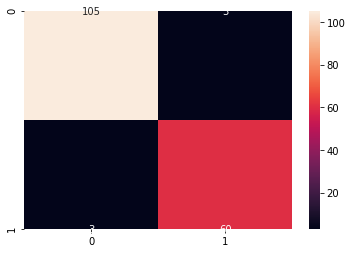
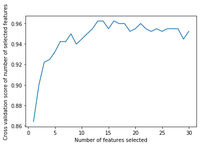

# Project 


The data has several columns, including:

Attribute Information:

1. ID number
2. Diagnosis (M = malignant, B = benign)

Ten real-valued features are computed for each cell nucleus:

1. radius (mean of distances from center to points on the perimeter)
2. texture (standard deviation of gray-scale values)
3. perimeter
4. area
5. smoothness (local variation in radius lengths)
6. compactness (perimeter^2 / area - 1.0)
7. concavity (severity of concave portions of the contour)
8. concave points (number of concave portions of the contour)
9. symmetry
10. fractal dimension ("coastline approximation" - 1)

The mean, standard error and "worst" or largest (mean of the three
largest values) of these features were computed for each image,
resulting in 30 features. For instance, field 3 is Mean Radius, field
13 is Radius SE, field 23 is Worst Radius.

All feature values are recoded with four significant digits.

Missing attribute values: none

This is the reference for data analysis part 
https://www.kaggle.com/kanncaa1/feature-selection-and-data-visualization#Data-Analysis

This is the reference for new machine learning methods:


```python
import pandas as pd
import seaborn as sns
import numpy as np
import matplotlib.pyplot as plt
import matplotlib
%matplotlib inline
```

## Read Data


```python
data_cancer = pd.read_csv("data-Breast-Cancer-Wisconsin.csv")
```


```python
data_cancer.head(10)

```


<div>
<style scoped>
    .dataframe tbody tr th:only-of-type {
        vertical-align: middle;
    }

    .dataframe tbody tr th {
        vertical-align: top;
    }
    
    .dataframe thead th {
        text-align: right;
    }
</style>
<table border="1" class="dataframe">
  <thead>
    <tr style="text-align: right;">
      <th></th>
      <th>id</th>
      <th>diagnosis</th>
      <th>radius_mean</th>
      <th>texture_mean</th>
      <th>perimeter_mean</th>
      <th>area_mean</th>
      <th>smoothness_mean</th>
      <th>compactness_mean</th>
      <th>concavity_mean</th>
      <th>concave points_mean</th>
      <th>...</th>
      <th>texture_worst</th>
      <th>perimeter_worst</th>
      <th>area_worst</th>
      <th>smoothness_worst</th>
      <th>compactness_worst</th>
      <th>concavity_worst</th>
      <th>concave points_worst</th>
      <th>symmetry_worst</th>
      <th>fractal_dimension_worst</th>
      <th>Unnamed: 32</th>
    </tr>
  </thead>
  <tbody>
    <tr>
      <th>0</th>
      <td>842302</td>
      <td>M</td>
      <td>17.99</td>
      <td>10.38</td>
      <td>122.80</td>
      <td>1001.0</td>
      <td>0.11840</td>
      <td>0.27760</td>
      <td>0.30010</td>
      <td>0.14710</td>
      <td>...</td>
      <td>17.33</td>
      <td>184.60</td>
      <td>2019.0</td>
      <td>0.1622</td>
      <td>0.6656</td>
      <td>0.7119</td>
      <td>0.2654</td>
      <td>0.4601</td>
      <td>0.11890</td>
      <td>NaN</td>
    </tr>
    <tr>
      <th>1</th>
      <td>842517</td>
      <td>M</td>
      <td>20.57</td>
      <td>17.77</td>
      <td>132.90</td>
      <td>1326.0</td>
      <td>0.08474</td>
      <td>0.07864</td>
      <td>0.08690</td>
      <td>0.07017</td>
      <td>...</td>
      <td>23.41</td>
      <td>158.80</td>
      <td>1956.0</td>
      <td>0.1238</td>
      <td>0.1866</td>
      <td>0.2416</td>
      <td>0.1860</td>
      <td>0.2750</td>
      <td>0.08902</td>
      <td>NaN</td>
    </tr>
    <tr>
      <th>2</th>
      <td>84300903</td>
      <td>M</td>
      <td>19.69</td>
      <td>21.25</td>
      <td>130.00</td>
      <td>1203.0</td>
      <td>0.10960</td>
      <td>0.15990</td>
      <td>0.19740</td>
      <td>0.12790</td>
      <td>...</td>
      <td>25.53</td>
      <td>152.50</td>
      <td>1709.0</td>
      <td>0.1444</td>
      <td>0.4245</td>
      <td>0.4504</td>
      <td>0.2430</td>
      <td>0.3613</td>
      <td>0.08758</td>
      <td>NaN</td>
    </tr>
    <tr>
      <th>3</th>
      <td>84348301</td>
      <td>M</td>
      <td>11.42</td>
      <td>20.38</td>
      <td>77.58</td>
      <td>386.1</td>
      <td>0.14250</td>
      <td>0.28390</td>
      <td>0.24140</td>
      <td>0.10520</td>
      <td>...</td>
      <td>26.50</td>
      <td>98.87</td>
      <td>567.7</td>
      <td>0.2098</td>
      <td>0.8663</td>
      <td>0.6869</td>
      <td>0.2575</td>
      <td>0.6638</td>
      <td>0.17300</td>
      <td>NaN</td>
    </tr>
    <tr>
      <th>4</th>
      <td>84358402</td>
      <td>M</td>
      <td>20.29</td>
      <td>14.34</td>
      <td>135.10</td>
      <td>1297.0</td>
      <td>0.10030</td>
      <td>0.13280</td>
      <td>0.19800</td>
      <td>0.10430</td>
      <td>...</td>
      <td>16.67</td>
      <td>152.20</td>
      <td>1575.0</td>
      <td>0.1374</td>
      <td>0.2050</td>
      <td>0.4000</td>
      <td>0.1625</td>
      <td>0.2364</td>
      <td>0.07678</td>
      <td>NaN</td>
    </tr>
    <tr>
      <th>5</th>
      <td>843786</td>
      <td>M</td>
      <td>12.45</td>
      <td>15.70</td>
      <td>82.57</td>
      <td>477.1</td>
      <td>0.12780</td>
      <td>0.17000</td>
      <td>0.15780</td>
      <td>0.08089</td>
      <td>...</td>
      <td>23.75</td>
      <td>103.40</td>
      <td>741.6</td>
      <td>0.1791</td>
      <td>0.5249</td>
      <td>0.5355</td>
      <td>0.1741</td>
      <td>0.3985</td>
      <td>0.12440</td>
      <td>NaN</td>
    </tr>
    <tr>
      <th>6</th>
      <td>844359</td>
      <td>M</td>
      <td>18.25</td>
      <td>19.98</td>
      <td>119.60</td>
      <td>1040.0</td>
      <td>0.09463</td>
      <td>0.10900</td>
      <td>0.11270</td>
      <td>0.07400</td>
      <td>...</td>
      <td>27.66</td>
      <td>153.20</td>
      <td>1606.0</td>
      <td>0.1442</td>
      <td>0.2576</td>
      <td>0.3784</td>
      <td>0.1932</td>
      <td>0.3063</td>
      <td>0.08368</td>
      <td>NaN</td>
    </tr>
    <tr>
      <th>7</th>
      <td>84458202</td>
      <td>M</td>
      <td>13.71</td>
      <td>20.83</td>
      <td>90.20</td>
      <td>577.9</td>
      <td>0.11890</td>
      <td>0.16450</td>
      <td>0.09366</td>
      <td>0.05985</td>
      <td>...</td>
      <td>28.14</td>
      <td>110.60</td>
      <td>897.0</td>
      <td>0.1654</td>
      <td>0.3682</td>
      <td>0.2678</td>
      <td>0.1556</td>
      <td>0.3196</td>
      <td>0.11510</td>
      <td>NaN</td>
    </tr>
    <tr>
      <th>8</th>
      <td>844981</td>
      <td>M</td>
      <td>13.00</td>
      <td>21.82</td>
      <td>87.50</td>
      <td>519.8</td>
      <td>0.12730</td>
      <td>0.19320</td>
      <td>0.18590</td>
      <td>0.09353</td>
      <td>...</td>
      <td>30.73</td>
      <td>106.20</td>
      <td>739.3</td>
      <td>0.1703</td>
      <td>0.5401</td>
      <td>0.5390</td>
      <td>0.2060</td>
      <td>0.4378</td>
      <td>0.10720</td>
      <td>NaN</td>
    </tr>
    <tr>
      <th>9</th>
      <td>84501001</td>
      <td>M</td>
      <td>12.46</td>
      <td>24.04</td>
      <td>83.97</td>
      <td>475.9</td>
      <td>0.11860</td>
      <td>0.23960</td>
      <td>0.22730</td>
      <td>0.08543</td>
      <td>...</td>
      <td>40.68</td>
      <td>97.65</td>
      <td>711.4</td>
      <td>0.1853</td>
      <td>1.0580</td>
      <td>1.1050</td>
      <td>0.2210</td>
      <td>0.4366</td>
      <td>0.20750</td>
      <td>NaN</td>
    </tr>
  </tbody>
</table>
<p>10 rows × 33 columns</p>
</div>


```python
data_cancer.describe()
```


<div>
<style scoped>
    .dataframe tbody tr th:only-of-type {
        vertical-align: middle;
    }

    .dataframe tbody tr th {
        vertical-align: top;
    }
    
    .dataframe thead th {
        text-align: right;
    }
</style>
<table border="1" class="dataframe">
  <thead>
    <tr style="text-align: right;">
      <th></th>
      <th>id</th>
      <th>radius_mean</th>
      <th>texture_mean</th>
      <th>perimeter_mean</th>
      <th>area_mean</th>
      <th>smoothness_mean</th>
      <th>compactness_mean</th>
      <th>concavity_mean</th>
      <th>concave points_mean</th>
      <th>symmetry_mean</th>
      <th>...</th>
      <th>texture_worst</th>
      <th>perimeter_worst</th>
      <th>area_worst</th>
      <th>smoothness_worst</th>
      <th>compactness_worst</th>
      <th>concavity_worst</th>
      <th>concave points_worst</th>
      <th>symmetry_worst</th>
      <th>fractal_dimension_worst</th>
      <th>Unnamed: 32</th>
    </tr>
  </thead>
  <tbody>
    <tr>
      <th>count</th>
      <td>5.690000e+02</td>
      <td>569.000000</td>
      <td>569.000000</td>
      <td>569.000000</td>
      <td>569.000000</td>
      <td>569.000000</td>
      <td>569.000000</td>
      <td>569.000000</td>
      <td>569.000000</td>
      <td>569.000000</td>
      <td>...</td>
      <td>569.000000</td>
      <td>569.000000</td>
      <td>569.000000</td>
      <td>569.000000</td>
      <td>569.000000</td>
      <td>569.000000</td>
      <td>569.000000</td>
      <td>569.000000</td>
      <td>569.000000</td>
      <td>0.0</td>
    </tr>
    <tr>
      <th>mean</th>
      <td>3.037183e+07</td>
      <td>14.127292</td>
      <td>19.289649</td>
      <td>91.969033</td>
      <td>654.889104</td>
      <td>0.096360</td>
      <td>0.104341</td>
      <td>0.088799</td>
      <td>0.048919</td>
      <td>0.181162</td>
      <td>...</td>
      <td>25.677223</td>
      <td>107.261213</td>
      <td>880.583128</td>
      <td>0.132369</td>
      <td>0.254265</td>
      <td>0.272188</td>
      <td>0.114606</td>
      <td>0.290076</td>
      <td>0.083946</td>
      <td>NaN</td>
    </tr>
    <tr>
      <th>std</th>
      <td>1.250206e+08</td>
      <td>3.524049</td>
      <td>4.301036</td>
      <td>24.298981</td>
      <td>351.914129</td>
      <td>0.014064</td>
      <td>0.052813</td>
      <td>0.079720</td>
      <td>0.038803</td>
      <td>0.027414</td>
      <td>...</td>
      <td>6.146258</td>
      <td>33.602542</td>
      <td>569.356993</td>
      <td>0.022832</td>
      <td>0.157336</td>
      <td>0.208624</td>
      <td>0.065732</td>
      <td>0.061867</td>
      <td>0.018061</td>
      <td>NaN</td>
    </tr>
    <tr>
      <th>min</th>
      <td>8.670000e+03</td>
      <td>6.981000</td>
      <td>9.710000</td>
      <td>43.790000</td>
      <td>143.500000</td>
      <td>0.052630</td>
      <td>0.019380</td>
      <td>0.000000</td>
      <td>0.000000</td>
      <td>0.106000</td>
      <td>...</td>
      <td>12.020000</td>
      <td>50.410000</td>
      <td>185.200000</td>
      <td>0.071170</td>
      <td>0.027290</td>
      <td>0.000000</td>
      <td>0.000000</td>
      <td>0.156500</td>
      <td>0.055040</td>
      <td>NaN</td>
    </tr>
    <tr>
      <th>25%</th>
      <td>8.692180e+05</td>
      <td>11.700000</td>
      <td>16.170000</td>
      <td>75.170000</td>
      <td>420.300000</td>
      <td>0.086370</td>
      <td>0.064920</td>
      <td>0.029560</td>
      <td>0.020310</td>
      <td>0.161900</td>
      <td>...</td>
      <td>21.080000</td>
      <td>84.110000</td>
      <td>515.300000</td>
      <td>0.116600</td>
      <td>0.147200</td>
      <td>0.114500</td>
      <td>0.064930</td>
      <td>0.250400</td>
      <td>0.071460</td>
      <td>NaN</td>
    </tr>
    <tr>
      <th>50%</th>
      <td>9.060240e+05</td>
      <td>13.370000</td>
      <td>18.840000</td>
      <td>86.240000</td>
      <td>551.100000</td>
      <td>0.095870</td>
      <td>0.092630</td>
      <td>0.061540</td>
      <td>0.033500</td>
      <td>0.179200</td>
      <td>...</td>
      <td>25.410000</td>
      <td>97.660000</td>
      <td>686.500000</td>
      <td>0.131300</td>
      <td>0.211900</td>
      <td>0.226700</td>
      <td>0.099930</td>
      <td>0.282200</td>
      <td>0.080040</td>
      <td>NaN</td>
    </tr>
    <tr>
      <th>75%</th>
      <td>8.813129e+06</td>
      <td>15.780000</td>
      <td>21.800000</td>
      <td>104.100000</td>
      <td>782.700000</td>
      <td>0.105300</td>
      <td>0.130400</td>
      <td>0.130700</td>
      <td>0.074000</td>
      <td>0.195700</td>
      <td>...</td>
      <td>29.720000</td>
      <td>125.400000</td>
      <td>1084.000000</td>
      <td>0.146000</td>
      <td>0.339100</td>
      <td>0.382900</td>
      <td>0.161400</td>
      <td>0.317900</td>
      <td>0.092080</td>
      <td>NaN</td>
    </tr>
    <tr>
      <th>max</th>
      <td>9.113205e+08</td>
      <td>28.110000</td>
      <td>39.280000</td>
      <td>188.500000</td>
      <td>2501.000000</td>
      <td>0.163400</td>
      <td>0.345400</td>
      <td>0.426800</td>
      <td>0.201200</td>
      <td>0.304000</td>
      <td>...</td>
      <td>49.540000</td>
      <td>251.200000</td>
      <td>4254.000000</td>
      <td>0.222600</td>
      <td>1.058000</td>
      <td>1.252000</td>
      <td>0.291000</td>
      <td>0.663800</td>
      <td>0.207500</td>
      <td>NaN</td>
    </tr>
  </tbody>
</table>
<p>8 rows × 32 columns</p>
</div>


```python
data_cancer.info()
```

    <class 'pandas.core.frame.DataFrame'>
    RangeIndex: 569 entries, 0 to 568
    Data columns (total 33 columns):
    id                         569 non-null int64
    diagnosis                  569 non-null object
    radius_mean                569 non-null float64
    texture_mean               569 non-null float64
    perimeter_mean             569 non-null float64
    area_mean                  569 non-null float64
    smoothness_mean            569 non-null float64
    compactness_mean           569 non-null float64
    concavity_mean             569 non-null float64
    concave points_mean        569 non-null float64
    symmetry_mean              569 non-null float64
    fractal_dimension_mean     569 non-null float64
    radius_se                  569 non-null float64
    texture_se                 569 non-null float64
    perimeter_se               569 non-null float64
    area_se                    569 non-null float64
    smoothness_se              569 non-null float64
    compactness_se             569 non-null float64
    concavity_se               569 non-null float64
    concave points_se          569 non-null float64
    symmetry_se                569 non-null float64
    fractal_dimension_se       569 non-null float64
    radius_worst               569 non-null float64
    texture_worst              569 non-null float64
    perimeter_worst            569 non-null float64
    area_worst                 569 non-null float64
    smoothness_worst           569 non-null float64
    compactness_worst          569 non-null float64
    concavity_worst            569 non-null float64
    concave points_worst       569 non-null float64
    symmetry_worst             569 non-null float64
    fractal_dimension_worst    569 non-null float64
    Unnamed: 32                0 non-null float64
    dtypes: float64(31), int64(1), object(1)
    memory usage: 146.8+ KB


```python
###the unnamed has 0 info,we delete it
drop_list1 = ['Unnamed: 32']
data_cancer_clear_1 = data_cancer.drop(drop_list1,axis = 1 )  
```


```python
#data_cancer_clear_1
```

# Data Analysis
* since there is nothing we need to clear, we directly do the data analysis
* we try to see theire relationship, and narrow down the feature
* for the beginning, we have
1. id                     
2. diagnosis              
3. radius_mean                
4. texture_mean                
5. perimeter_mean             
6. area_mean                  
7. smoothness_mean          
8. compactness_mean           
9. concavity_mean             
10. concave points_mean      
11. symmetry_mean         
12. fractal_dimension_mean     
13. radius_se               
14. texture_se              
15. perimeter_se            
16. area_se                   
17. smoothness_se            
18. compactness_se            
19. concavity_se           
20. concave points_se      
21. symmetry_se             
22. fractal_dimension_se      
23. radius_worst              
24. texture_worst           
25. perimeter_worst          
26. area_worst                 
27. smoothness_worst         
28. compactness_worst         
29. concavity_worst            
30. concave points_worst      
31. symmetry_worst             
32. fractal_dimension_worst   


```python
# the diagnosis is our prediction, therefore, we shall split it, denote it as y
# we put the rest into another set, denote it as x

y=data_cancer_clear_1['diagnosis']
drop_list2 = ['id','diagnosis']
x_raw = data_cancer_clear_1.drop(drop_list2,axis = 1 )  

```


```python
#x_raw
```

* we read a little bit about the variable y


```python
ax = sns.countplot(y,label="Count")       # M = 212, B = 357
B, M = y.value_counts()

```





we can see here, this question is a very significant binary classification/regression since it only has two outcomes


```python
# we are back to the x_raw
x_raw.describe()
```


<div>
<style scoped>
    .dataframe tbody tr th:only-of-type {
        vertical-align: middle;
    }

    .dataframe tbody tr th {
        vertical-align: top;
    }
    
    .dataframe thead th {
        text-align: right;
    }
</style>
<table border="1" class="dataframe">
  <thead>
    <tr style="text-align: right;">
      <th></th>
      <th>radius_mean</th>
      <th>texture_mean</th>
      <th>perimeter_mean</th>
      <th>area_mean</th>
      <th>smoothness_mean</th>
      <th>compactness_mean</th>
      <th>concavity_mean</th>
      <th>concave points_mean</th>
      <th>symmetry_mean</th>
      <th>fractal_dimension_mean</th>
      <th>...</th>
      <th>radius_worst</th>
      <th>texture_worst</th>
      <th>perimeter_worst</th>
      <th>area_worst</th>
      <th>smoothness_worst</th>
      <th>compactness_worst</th>
      <th>concavity_worst</th>
      <th>concave points_worst</th>
      <th>symmetry_worst</th>
      <th>fractal_dimension_worst</th>
    </tr>
  </thead>
  <tbody>
    <tr>
      <th>count</th>
      <td>569.000000</td>
      <td>569.000000</td>
      <td>569.000000</td>
      <td>569.000000</td>
      <td>569.000000</td>
      <td>569.000000</td>
      <td>569.000000</td>
      <td>569.000000</td>
      <td>569.000000</td>
      <td>569.000000</td>
      <td>...</td>
      <td>569.000000</td>
      <td>569.000000</td>
      <td>569.000000</td>
      <td>569.000000</td>
      <td>569.000000</td>
      <td>569.000000</td>
      <td>569.000000</td>
      <td>569.000000</td>
      <td>569.000000</td>
      <td>569.000000</td>
    </tr>
    <tr>
      <th>mean</th>
      <td>14.127292</td>
      <td>19.289649</td>
      <td>91.969033</td>
      <td>654.889104</td>
      <td>0.096360</td>
      <td>0.104341</td>
      <td>0.088799</td>
      <td>0.048919</td>
      <td>0.181162</td>
      <td>0.062798</td>
      <td>...</td>
      <td>16.269190</td>
      <td>25.677223</td>
      <td>107.261213</td>
      <td>880.583128</td>
      <td>0.132369</td>
      <td>0.254265</td>
      <td>0.272188</td>
      <td>0.114606</td>
      <td>0.290076</td>
      <td>0.083946</td>
    </tr>
    <tr>
      <th>std</th>
      <td>3.524049</td>
      <td>4.301036</td>
      <td>24.298981</td>
      <td>351.914129</td>
      <td>0.014064</td>
      <td>0.052813</td>
      <td>0.079720</td>
      <td>0.038803</td>
      <td>0.027414</td>
      <td>0.007060</td>
      <td>...</td>
      <td>4.833242</td>
      <td>6.146258</td>
      <td>33.602542</td>
      <td>569.356993</td>
      <td>0.022832</td>
      <td>0.157336</td>
      <td>0.208624</td>
      <td>0.065732</td>
      <td>0.061867</td>
      <td>0.018061</td>
    </tr>
    <tr>
      <th>min</th>
      <td>6.981000</td>
      <td>9.710000</td>
      <td>43.790000</td>
      <td>143.500000</td>
      <td>0.052630</td>
      <td>0.019380</td>
      <td>0.000000</td>
      <td>0.000000</td>
      <td>0.106000</td>
      <td>0.049960</td>
      <td>...</td>
      <td>7.930000</td>
      <td>12.020000</td>
      <td>50.410000</td>
      <td>185.200000</td>
      <td>0.071170</td>
      <td>0.027290</td>
      <td>0.000000</td>
      <td>0.000000</td>
      <td>0.156500</td>
      <td>0.055040</td>
    </tr>
    <tr>
      <th>25%</th>
      <td>11.700000</td>
      <td>16.170000</td>
      <td>75.170000</td>
      <td>420.300000</td>
      <td>0.086370</td>
      <td>0.064920</td>
      <td>0.029560</td>
      <td>0.020310</td>
      <td>0.161900</td>
      <td>0.057700</td>
      <td>...</td>
      <td>13.010000</td>
      <td>21.080000</td>
      <td>84.110000</td>
      <td>515.300000</td>
      <td>0.116600</td>
      <td>0.147200</td>
      <td>0.114500</td>
      <td>0.064930</td>
      <td>0.250400</td>
      <td>0.071460</td>
    </tr>
    <tr>
      <th>50%</th>
      <td>13.370000</td>
      <td>18.840000</td>
      <td>86.240000</td>
      <td>551.100000</td>
      <td>0.095870</td>
      <td>0.092630</td>
      <td>0.061540</td>
      <td>0.033500</td>
      <td>0.179200</td>
      <td>0.061540</td>
      <td>...</td>
      <td>14.970000</td>
      <td>25.410000</td>
      <td>97.660000</td>
      <td>686.500000</td>
      <td>0.131300</td>
      <td>0.211900</td>
      <td>0.226700</td>
      <td>0.099930</td>
      <td>0.282200</td>
      <td>0.080040</td>
    </tr>
    <tr>
      <th>75%</th>
      <td>15.780000</td>
      <td>21.800000</td>
      <td>104.100000</td>
      <td>782.700000</td>
      <td>0.105300</td>
      <td>0.130400</td>
      <td>0.130700</td>
      <td>0.074000</td>
      <td>0.195700</td>
      <td>0.066120</td>
      <td>...</td>
      <td>18.790000</td>
      <td>29.720000</td>
      <td>125.400000</td>
      <td>1084.000000</td>
      <td>0.146000</td>
      <td>0.339100</td>
      <td>0.382900</td>
      <td>0.161400</td>
      <td>0.317900</td>
      <td>0.092080</td>
    </tr>
    <tr>
      <th>max</th>
      <td>28.110000</td>
      <td>39.280000</td>
      <td>188.500000</td>
      <td>2501.000000</td>
      <td>0.163400</td>
      <td>0.345400</td>
      <td>0.426800</td>
      <td>0.201200</td>
      <td>0.304000</td>
      <td>0.097440</td>
      <td>...</td>
      <td>36.040000</td>
      <td>49.540000</td>
      <td>251.200000</td>
      <td>4254.000000</td>
      <td>0.222600</td>
      <td>1.058000</td>
      <td>1.252000</td>
      <td>0.291000</td>
      <td>0.663800</td>
      <td>0.207500</td>
    </tr>
  </tbody>
</table>
<p>8 rows × 30 columns</p>
</div>


```python
##We can see that obviously the scale of different datas are quite different. 
##Therefore, we need to standirdize or normalize them 
##before visualization, feature selection, feature extraction or classificaiton

x_standardize=(x_raw-x_raw.mean())/(x_raw.std())
```

# Visualization
1. see the relationship between each feature and the y
2. see the relationship between each feature


```python
## first to the first ten features
# data_split=y_input
# data_x=x_standardize.iloc[:,0:10]
# data_visualization=pd.concat([data_split,data_x],axis=1)

#     ## we would like to know the relationship between each feature and the y 
# data_visualization_final = pd.melt(data_visualization,id_vars="diagnosis",
#                         var_name="features",
#                         value_name='value')

# plt.figure(figsize=(10,10))
# #method=='swarmplot':
# sns.swarmplot(x="features", y="value", hue="diagnosis", data=data_visualization_final)
# #sns.violinplot(x="features", y="value", hue="diagnosis", data=data_visualization_final,split=True, inner="quart")
# #sns.boxplot(x="features", y="value", hue="diagnosis", data=data_visualization_final)
# plt.xticks(rotation=90)

```


```python
## we develop a function to help us visulization the relationship between the feature x and the y 
def data_visulization(y_input, x_input, method):
    data_split=y_input
    #data_x=x_standardize.iloc[:,0:10]
    data_x=x_input
    data_visualization=pd.concat([data_split,data_x],axis=1)

    ## we would like to know the relationship between each feature and the y 
    data_visualization_final = pd.melt(data_visualization,id_vars="diagnosis",
                        var_name="features",
                        value_name='value')

    plt.figure(figsize=(10,10))
    ###base on the method we choose to define the graph like
    if method=='swarmplot':
        sns.swarmplot(x="features", y="value", hue="diagnosis", data=data_visualization_final)
    elif method=='violinplot':
        sns.violinplot(x="features", y="value", hue="diagnosis", data=data_visualization_final,split=True, inner="quart")
    else:
        sns.boxplot(x="features", y="value", hue="diagnosis", data=data_visualization_final)
    plt.xticks(rotation=90)

    
```


```python
### first ten features
y_input=y
x_input=x_standardize.iloc[:,0:10]
### we can choose 'violinplot', 'boxplot' and 'swarmplot'
method='swarmplot'
data_visulization(y_input,x_input, method)
```





```python
### second ten features
y_input=y
x_input=x_standardize.iloc[:,11:20]
### we can choose 'violinplot', 'boxplot' and 'swarmplot'
method='violinplot'
data_visulization(y_input,x_input, method)
```





```python
### third ten features
y_input=y
x_input=x_standardize.iloc[:,21:31]
### we can choose 'violinplot', 'boxplot' and 'swarmplot'
method='boxplot'
data_visulization(y_input,x_input, method)
```





now we work on the relationship between the feature to see if we can drop some features


```python
#correlation map
# f,ax = plt.subplots(figsize=(13, 13))

# ##change the color you like
# cmap = sns.diverging_palette(230, 20, as_cmap=True)
# xcorr=x_standardize.corr()

# #mask为 和相关系数矩阵xcorr一样大的 全0(False)矩阵
# mask = np.zeros_like(xcorr, dtype=np.bool)
# # 将mask右上三角(列号》=行号)设置为True
# mask[np.triu_indices_from(mask)] = True

# sns.heatmap(xcorr, annot=True, linewidths=0.5, fmt= '.1f',ax=ax, cmap=cmap, mask=mask)


def find_corr_heatmap(df):
    #correlation map
    f,ax = plt.subplots(figsize=(13, 13))

    ##change the color you like
    cmap = sns.diverging_palette(230, 20, as_cmap=True)
    xcorr=df.corr()

    #mask为 和相关系数矩阵xcorr一样大的 全0(False)矩阵
    mask = np.zeros_like(xcorr, dtype=np.bool)
    # 将mask右上三角(列号》=行号)设置为True
    mask[np.triu_indices_from(mask)] = True

    sns.heatmap(xcorr, annot=True, linewidths=0.5, fmt= '.1f',ax=ax, cmap=cmap, mask=mask)
    
    
find_corr_heatmap(x_standardize)
```





we can see from this correlation in this heatmap:
1. primeter_mean & area_mean & radius mean are related
 * radius_worst& perimeter_worse& area_worst are related, and they are related to previous
2. compactness_worst and concavity_worst and concave points_worst are related
3. compactness_se &concavity_se and concave points_se are related


## 1)Feature selection with correlation
### 1*) Feature selection with low variance

1. input y and x_standardize
2. 方差过滤


```python
### we delete some relevance feature and see if we can do more

# drop_list1 = ['perimeter_mean','radius_mean','compactness_mean','concave points_mean',
#               'radius_se','perimeter_se','radius_worst','perimeter_worst',
#               'compactness_worst','concave points_worst','compactness_se',
#               'concave points_se','texture_worst','area_worst']
drop_list3=['perimeter_mean', 'area_mean', 'radius_worst','perimeter_worst','area_worst']
x_standardize_1= x_standardize.drop(drop_list3,axis = 1 )  
#find_corr_heatmap(x_standardize_1)

drop_list3=['area_se','perimeter_se']
x_standardize_1= x_standardize_1.drop(drop_list3,axis = 1 )  
find_corr_heatmap(x_standardize_1)
```





### Machine Learning methods:
1. inpout y and x_standardize and x_standardize_1
2. we use random forest to decice how many features we choose


```python
from sklearn.model_selection import train_test_split
from sklearn.ensemble import RandomForestClassifier
from sklearn.metrics import f1_score,confusion_matrix
from sklearn.metrics import accuracy_score

# split data train 70 % and test 30 %
#x_train, x_test, y_train, y_test = train_test_split(x_standardize, y, test_size=0.3, random_state=42)
## for here we do not use standardize data
x_train, x_test, y_train, y_test = train_test_split(x_standardize_1, y, test_size=0.3, random_state=42)

#random forest classifier with n_estimators=10 (default)
clf_rf = RandomForestClassifier(random_state=20)      
clr_rf = clf_rf.fit(x_train,y_train)

ac = accuracy_score(y_test,clf_rf.predict(x_test))
print('Accuracy is: ',ac)
cm = confusion_matrix(y_test,clf_rf.predict(x_test))

sns.heatmap(cm,annot=True,fmt="d")

```

    Accuracy is:  0.9473684210526315


    <matplotlib.axes._subplots.AxesSubplot at 0x11ed5c128>





```python
# split data train 70 % and test 30 %
#x_train, x_test, y_train, y_test = train_test_split(x_standardize, y, test_size=0.3, random_state=42)
## for here we do not use standardize data
x_train, x_test, y_train, y_test = train_test_split(x_raw, y, test_size=0.3, random_state=42)

#random forest classifier with n_estimators=10 (default)
clf_rf = RandomForestClassifier(random_state=20)      
clr_rf = clf_rf.fit(x_train,y_train)

ac = accuracy_score(y_test,clf_rf.predict(x_test))
print('Accuracy is: ',ac)
cm = confusion_matrix(y_test,clf_rf.predict(x_test))

sns.heatmap(cm,annot=True,fmt="d")
```

    Accuracy is:  0.9766081871345029


    <matplotlib.axes._subplots.AxesSubplot at 0x11f5f5c88>





## 2)Feature selection with Univariate feature selection

1. we try to narrow down the features
2. how many features? 5, 10, 15?
3. what is in this 5, 10, 15 features?


```python
## for here we only choose 5 features and the best 5 features
## this only base on your training set has been set up
from sklearn.feature_selection import SelectKBest
from sklearn.feature_selection import chi2
# find best scored 5 features
select_feature = SelectKBest(chi2, k=5).fit(x_train, y_train)
```


```python
### double check with this feature selection
### we still use random forest

x_train_2 = select_feature.transform(x_train)
x_test_2 = select_feature.transform(x_test)
#random forest classifier with n_estimators=10 (default)
clf_rf_2 = RandomForestClassifier()      
clr_rf_2 = clf_rf_2.fit(x_train_2,y_train)
ac_2 = accuracy_score(y_test,clf_rf_2.predict(x_test_2))
print('Accuracy is: ',ac_2)
cm_2 = confusion_matrix(y_test,clf_rf_2.predict(x_test_2))
sns.heatmap(cm_2,annot=True,fmt="d")
```

    Accuracy is:  0.9649122807017544


    <matplotlib.axes._subplots.AxesSubplot at 0x11ff88978>





It seems we dont have a better performance

## 3)Feature selection with Recursive feature elimination (RFE) 
1. inpout y and x_standardize


```python
from sklearn.feature_selection import RFE
# Create the RFE object and rank each pixel
clf_rf_3 = RandomForestClassifier()      
rfe = RFE(estimator=clf_rf_3, n_features_to_select=5, step=1)
rfe = rfe.fit(x_train, y_train)

```


```python
print('The best five features by RFE:',x_train.columns[rfe.support_])
```

    The best five features by RFE: Index(['concave points_mean', 'radius_worst', 'perimeter_worst', 'area_worst',
           'concave points_worst'],
          dtype='object')


## 4)Feature selection with Recursive feature elimination with cross validation(RFECV)


```python
from sklearn.feature_selection import RFECV

# The "accuracy" scoring is proportional to the number of correct classifications
clf_rf_4 = RandomForestClassifier() 
rfecv = RFECV(estimator=clf_rf_4, step=1, cv=10,scoring='accuracy')   #10-fold cross-validation
rfecv = rfecv.fit(x_train, y_train)

print('Optimal number of features :', rfecv.n_features_)
print('Best features :', x_train.columns[rfecv.support_])
```

    Optimal number of features : 16
    Best features : Index(['radius_mean', 'texture_mean', 'perimeter_mean', 'area_mean',
           'concavity_mean', 'concave points_mean', 'area_se', 'radius_worst',
           'texture_worst', 'perimeter_worst', 'area_worst', 'smoothness_worst',
           'compactness_worst', 'concavity_worst', 'concave points_worst',
           'symmetry_worst'],
          dtype='object')


```python
# Plot number of features VS. cross-validation scores
import matplotlib.pyplot as plt
plt.figure()
plt.xlabel("Number of features selected")
plt.ylabel("Cross validation score of number of selected features")
plt.plot(range(1, len(rfecv.grid_scores_) + 1), rfecv.grid_scores_)
plt.show()
```





## 5)Feature selection with RFE with GenericUnivariateSelect


```python
###TBA
```

## 6) Feature selection with Tree based feature selection(only for RF)


```python
###TBA
```

## 7) Feature Extraction: PCA


```python
###TBA
```

# Machine Learning-focus on SVM


```python
from sklearn.model_selection import cross_val_score, train_test_split
from sklearn.pipeline import Pipeline
from sklearn.preprocessing import StandardScaler, MinMaxScaler

x_train, x_test, y_train, y_test = train_test_split(x_standardize_1, y, test_size=0.3, random_state=42)


```


```python
from sklearn.metrics import accuracy_score, confusion_matrix, classification_report, f1_score

def print_score(clf, X_train, y_train, X_test, y_test, train=True):
    if train:
        pred = clf.predict(X_train)
        clf_report = pd.DataFrame(classification_report(y_train, pred, output_dict=True))
        print("Train Result:\n================================================")
        print(f"Accuracy Score: {accuracy_score(y_train, pred) * 100:.2f}%")
        print("_______________________________________________")
        print(f"CLASSIFICATION REPORT:\n{clf_report}")
        print("_______________________________________________")
        print(f"Confusion Matrix: \n {confusion_matrix(y_train, pred)}\n")
        
    elif train==False:
        pred = clf.predict(X_test)
        clf_report = pd.DataFrame(classification_report(y_test, pred, output_dict=True))
        print("Test Result:\n================================================")        
        print(f"Accuracy Score: {accuracy_score(y_test, pred) * 100:.2f}%")
        print("_______________________________________________")
        print(f"CLASSIFICATION REPORT:\n{clf_report}")
        print("_______________________________________________")
        print(f"Confusion Matrix: \n {confusion_matrix(y_test, pred)}\n")
```

### 1. Linear Kernel SVM


```python
from sklearn.svm import SVC

model = SVC(kernel='linear')
model.fit(x_train, y_train)

print_score(model, x_train, y_train, x_test, y_test, train=True)
print_score(model, x_train, y_train, x_test, y_test, train=False)
```

    Train Result:
    ================================================
    Accuracy Score: 98.99%
    _______________________________________________
    CLASSIFICATION REPORT:
                        B           M  accuracy   macro avg  weighted avg
    precision    0.984190    1.000000   0.98995    0.992095      0.990109
    recall       1.000000    0.973154   0.98995    0.986577      0.989950
    f1-score     0.992032    0.986395   0.98995    0.989213      0.989921
    support    249.000000  149.000000   0.98995  398.000000    398.000000
    _______________________________________________
    Confusion Matrix: 
     [[249   0]
     [  4 145]]
    
    Test Result:
    ================================================
    Accuracy Score: 97.08%
    _______________________________________________
    CLASSIFICATION REPORT:
                        B          M  accuracy   macro avg  weighted avg
    precision    0.981308   0.953125   0.97076    0.967217      0.970925
    recall       0.972222   0.968254   0.97076    0.970238      0.970760
    f1-score     0.976744   0.960630   0.97076    0.968687      0.970807
    support    108.000000  63.000000   0.97076  171.000000    171.000000
    _______________________________________________
    Confusion Matrix: 
     [[105   3]
     [  2  61]]


### Polynomial Kernel SVM¶


```python
from sklearn.svm import SVC

model = SVC(kernel='poly', degree=2, gamma='auto')
model.fit(x_train, y_train)

print_score(model, x_train, y_train, x_test, y_test, train=True)
print_score(model, x_train, y_train, x_test, y_test, train=False)
```

    Train Result:
    ================================================
    Accuracy Score: 83.42%
    _______________________________________________
    CLASSIFICATION REPORT:
                        B           M  accuracy   macro avg  weighted avg
    precision    0.794212    0.977011  0.834171    0.885612      0.862647
    recall       0.991968    0.570470  0.834171    0.781219      0.834171
    f1-score     0.882143    0.720339  0.834171    0.801241      0.821568
    support    249.000000  149.000000  0.834171  398.000000    398.000000
    _______________________________________________
    Confusion Matrix: 
     [[247   2]
     [ 64  85]]
    
    Test Result:
    ================================================
    Accuracy Score: 79.53%
    _______________________________________________
    CLASSIFICATION REPORT:
                        B          M  accuracy   macro avg  weighted avg
    precision    0.770370   0.888889  0.795322    0.829630      0.814035
    recall       0.962963   0.507937  0.795322    0.735450      0.795322
    f1-score     0.855967   0.646465  0.795322    0.751216      0.778782
    support    108.000000  63.000000  0.795322  171.000000    171.000000
    _______________________________________________
    Confusion Matrix: 
     [[104   4]
     [ 31  32]]


### Radial Kernel SVM¶


```python
from sklearn.svm import SVC

model = SVC(kernel='rbf', gamma=1)
model.fit(x_train, y_train)

print_score(model, x_train, y_train, x_test, y_test, train=True)
print_score(model, x_train, y_train, x_test, y_test, train=False)
```

    Train Result:
    ================================================
    Accuracy Score: 100.00%
    _______________________________________________
    CLASSIFICATION REPORT:
                   B      M  accuracy  macro avg  weighted avg
    precision    1.0    1.0       1.0        1.0           1.0
    recall       1.0    1.0       1.0        1.0           1.0
    f1-score     1.0    1.0       1.0        1.0           1.0
    support    249.0  149.0       1.0      398.0         398.0
    _______________________________________________
    Confusion Matrix: 
     [[249   0]
     [  0 149]]
    
    Test Result:
    ================================================
    Accuracy Score: 64.33%
    _______________________________________________
    CLASSIFICATION REPORT:
                        B          M  accuracy   macro avg  weighted avg
    precision    0.639053   1.000000  0.643275    0.819527      0.772034
    recall       1.000000   0.031746  0.643275    0.515873      0.643275
    f1-score     0.779783   0.061538  0.643275    0.420661      0.515167
    support    108.000000  63.000000  0.643275  171.000000    171.000000
    _______________________________________________
    Confusion Matrix: 
     [[108   0]
     [ 61   2]]


```python

```
