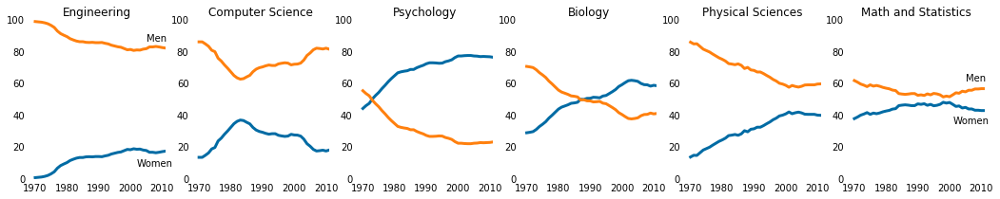
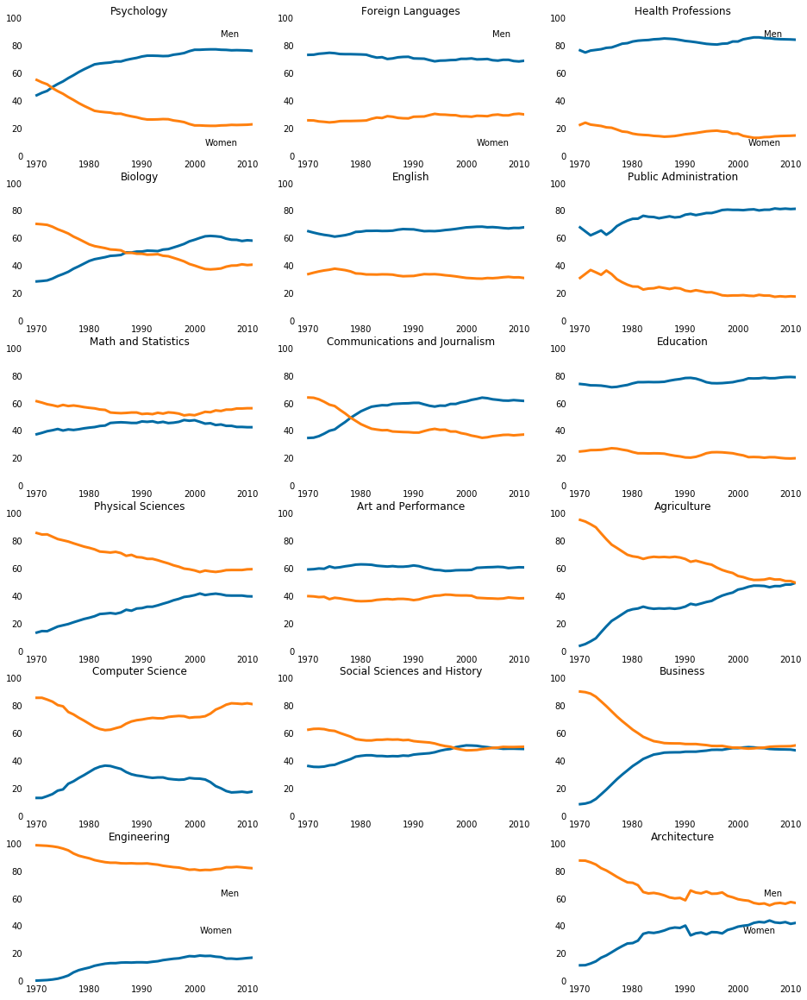
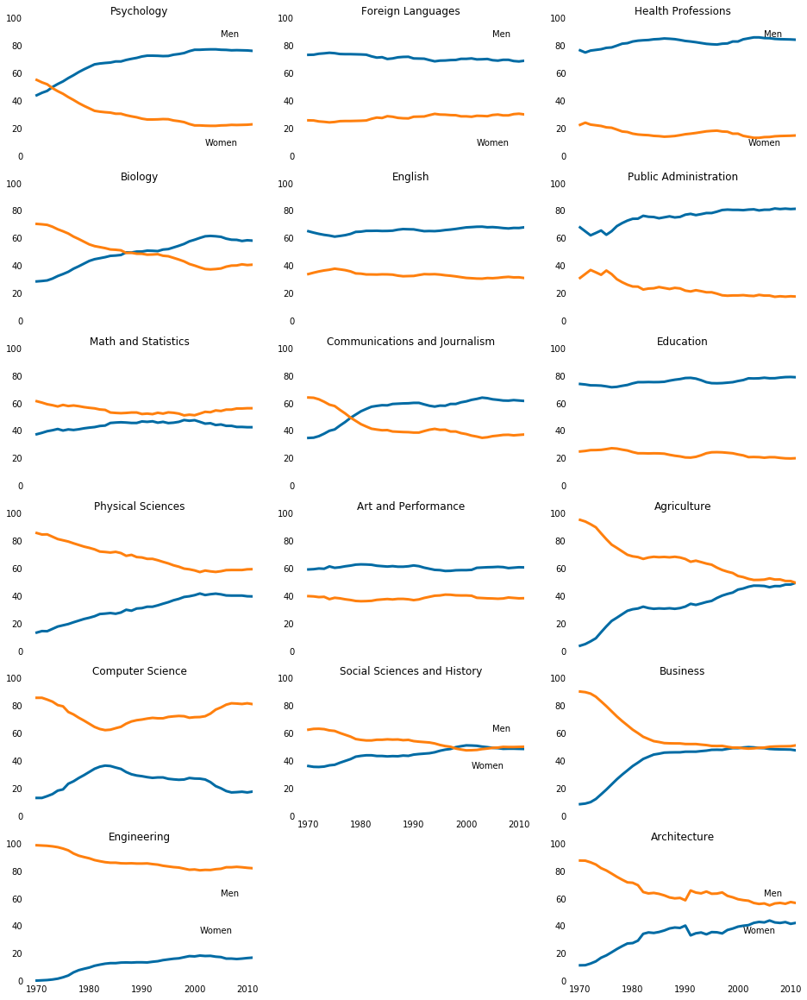
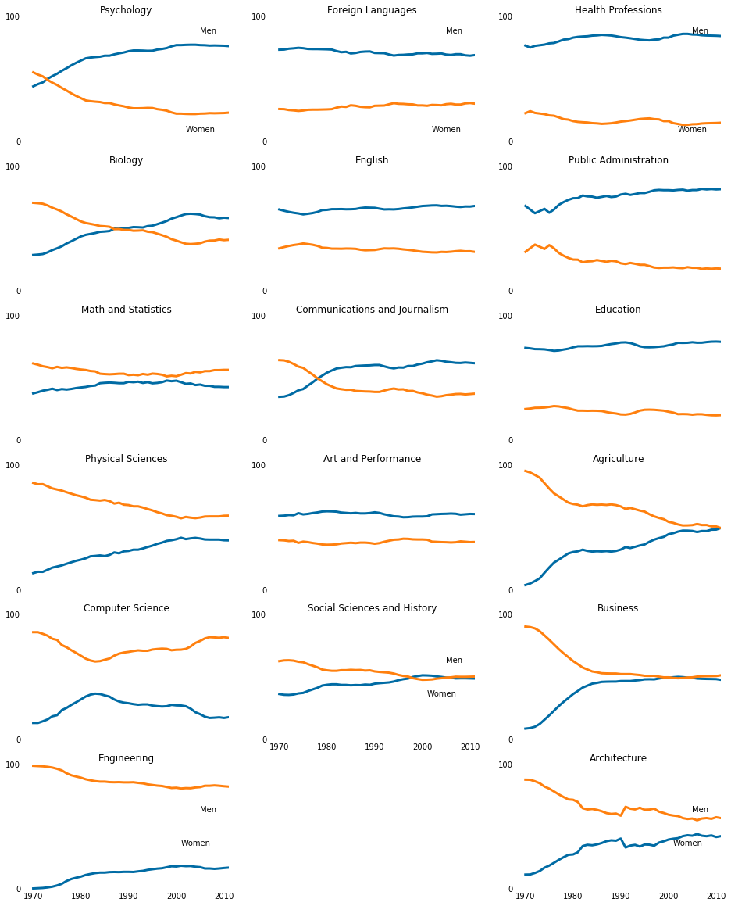
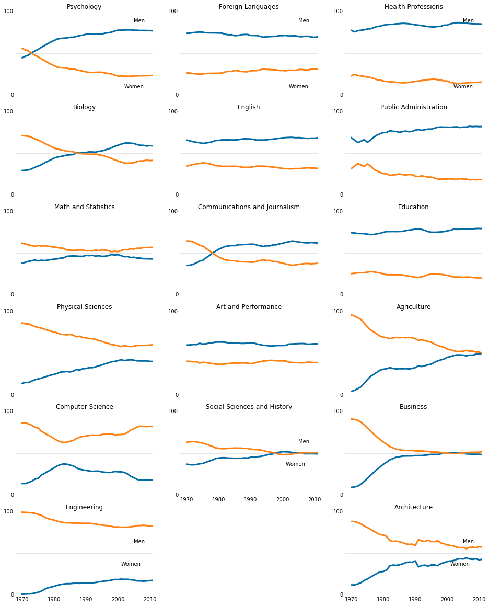

```python
%matplotlib inline
import pandas as pd
import matplotlib.pyplot as plt

women_degrees = pd.read_csv('percent-bachelors-degrees-women-usa.csv')
cb_dark_blue = (0/255,107/255,164/255)
cb_orange = (255/255, 128/255, 14/255)
stem_cats = ['Engineering', 'Computer Science', 'Psychology', 'Biology', 'Physical Sciences', 'Math and Statistics']

fig = plt.figure(figsize=(18, 3))

for sp in range(0,6):
    ax = fig.add_subplot(1,6,sp+1)
    ax.plot(women_degrees['Year'], women_degrees[stem_cats[sp]], c=cb_dark_blue, label='Women', linewidth=3)
    ax.plot(women_degrees['Year'], 100-women_degrees[stem_cats[sp]], c=cb_orange, label='Men', linewidth=3)
    ax.spines["right"].set_visible(False)    
    ax.spines["left"].set_visible(False)
    ax.spines["top"].set_visible(False)    
    ax.spines["bottom"].set_visible(False)
    ax.set_xlim(1968, 2011)
    ax.set_ylim(0,100)
    ax.set_title(stem_cats[sp])
    ax.tick_params(bottom="off", top="off", left="off", right="off")
    
    if sp == 0:
        ax.text(2005, 87, 'Men')
        ax.text(2002, 8, 'Women')
    elif sp == 5:
        ax.text(2005, 62, 'Men')
        ax.text(2001, 35, 'Women')
plt.show()


```





```python
stem_cats = ['Psychology', 'Biology', 'Math and Statistics', 'Physical Sciences', 'Computer Science', 'Engineering']
lib_arts_cats = ['Foreign Languages', 'English', 'Communications and Journalism', 'Art and Performance', 'Social Sciences and History']
other_cats = ['Health Professions', 'Public Administration', 'Education', 'Agriculture','Business', 'Architecture']
```


```python
fig = plt.figure(figsize=(16, 20))

for sp in range(0,18,3):
    inner_index=int(sp/3)
    ax = fig.add_subplot(6,3,sp+1)
    ax.plot(women_degrees['Year'], women_degrees[stem_cats[inner_index]], c=cb_dark_blue, label='Women', linewidth=3)
    ax.plot(women_degrees['Year'], 100-women_degrees[stem_cats[inner_index]], c=cb_orange, label='Men', linewidth=3)
    ax.spines["right"].set_visible(False)    
    ax.spines["left"].set_visible(False)
    ax.spines["top"].set_visible(False)    
    ax.spines["bottom"].set_visible(False)
    ax.set_xlim(1968, 2011)
    ax.set_ylim(0,100)
    ax.set_title(stem_cats[inner_index])
    ax.tick_params(bottom="off", top="off", left="off", right="off")
    
    if inner_index == 0:
        ax.text(2005, 87, 'Men')
        ax.text(2002, 8, 'Women')
    elif inner_index == 5:
        ax.text(2005, 62, 'Men')
        ax.text(2001, 35, 'Women')


for sp in range(0,15,3):
    inner_index=int(sp/3)
    ax = fig.add_subplot(6,3,sp+2)
    ax.plot(women_degrees['Year'], women_degrees[lib_arts_cats[inner_index]], c=cb_dark_blue, label='Women', linewidth=3)
    ax.plot(women_degrees['Year'], 100-women_degrees[lib_arts_cats[inner_index]], c=cb_orange, label='Men', linewidth=3)
    ax.spines["right"].set_visible(False)    
    ax.spines["left"].set_visible(False)
    ax.spines["top"].set_visible(False)    
    ax.spines["bottom"].set_visible(False)
    ax.set_xlim(1968, 2011)
    ax.set_ylim(0,100)
    ax.set_title(lib_arts_cats[inner_index])
    ax.tick_params(bottom="off", top="off", left="off", right="off")
    
    if inner_index == 0:
        ax.text(2005, 87, 'Men')
        ax.text(2002, 8, 'Women')
    elif inner_index == 5:
        ax.text(2005, 62, 'Men')
        ax.text(2001, 35, 'Women')

for sp in range(0,18,3):
    inner_index=int(sp/3)
    ax = fig.add_subplot(6,3,sp+3)
    ax.plot(women_degrees['Year'], women_degrees[other_cats[inner_index]], c=cb_dark_blue, label='Women', linewidth=3)
    ax.plot(women_degrees['Year'], 100-women_degrees[other_cats[inner_index]], c=cb_orange, label='Men', linewidth=3)
    ax.spines["right"].set_visible(False)    
    ax.spines["left"].set_visible(False)
    ax.spines["top"].set_visible(False)    
    ax.spines["bottom"].set_visible(False)
    ax.set_xlim(1968, 2011)
    ax.set_ylim(0,100)
    ax.set_title(other_cats[inner_index])
    ax.tick_params(bottom="off", top="off", left="off", right="off")
    
    if inner_index == 0:
        ax.text(2005, 87, 'Men')
        ax.text(2002, 8, 'Women')
    elif inner_index == 5:
        ax.text(2005, 62, 'Men')
        ax.text(2001, 35, 'Women')

```





```python

```


```python
fig = plt.figure(figsize=(16, 20))

for sp in range(0,18,3):
    inner_index=int(sp/3)
    ax = fig.add_subplot(6,3,sp+1)
    ax.plot(women_degrees['Year'], women_degrees[stem_cats[inner_index]], c=cb_dark_blue, label='Women', linewidth=3)
    ax.plot(women_degrees['Year'], 100-women_degrees[stem_cats[inner_index]], c=cb_orange, label='Men', linewidth=3)
    ax.spines["right"].set_visible(False)    
    ax.spines["left"].set_visible(False)
    ax.spines["top"].set_visible(False)    
    ax.spines["bottom"].set_visible(False)
    ax.set_xlim(1968, 2011)
    ax.set_ylim(0,100)
    ax.set_title(stem_cats[inner_index])
    ax.tick_params(bottom="off", top="off", left="off", right="off",labelbottom='off')
    
    if inner_index == 0:
        ax.text(2005, 87, 'Men')
        ax.text(2002, 8, 'Women')
    elif inner_index == 5:
        ax.text(2005, 62, 'Men')
        ax.text(2001, 35, 'Women')
        ax.tick_params(labelbottom='on')

for sp in range(0,15,3):
    inner_index=int(sp/3)
    ax = fig.add_subplot(6,3,sp+2)
    ax.plot(women_degrees['Year'], women_degrees[lib_arts_cats[inner_index]], c=cb_dark_blue, label='Women', linewidth=3)
    ax.plot(women_degrees['Year'], 100-women_degrees[lib_arts_cats[inner_index]], c=cb_orange, label='Men', linewidth=3)
    ax.spines["right"].set_visible(False)    
    ax.spines["left"].set_visible(False)
    ax.spines["top"].set_visible(False)    
    ax.spines["bottom"].set_visible(False)
    ax.set_xlim(1968, 2011)
    ax.set_ylim(0,100)
    ax.set_title(lib_arts_cats[inner_index])
    ax.tick_params(bottom="off", top="off", left="off", right="off",labelbottom='off')
    
    if inner_index == 0:
        ax.text(2005, 87, 'Men')
        ax.text(2002, 8, 'Women')
    elif inner_index == 4:
        ax.text(2005, 62, 'Men')
        ax.text(2001, 35, 'Women')
        ax.tick_params(labelbottom='on')

for sp in range(0,18,3):
    inner_index=int(sp/3)
    ax = fig.add_subplot(6,3,sp+3)
    ax.plot(women_degrees['Year'], women_degrees[other_cats[inner_index]], c=cb_dark_blue, label='Women', linewidth=3)
    ax.plot(women_degrees['Year'], 100-women_degrees[other_cats[inner_index]], c=cb_orange, label='Men', linewidth=3)
    ax.spines["right"].set_visible(False)    
    ax.spines["left"].set_visible(False)
    ax.spines["top"].set_visible(False)    
    ax.spines["bottom"].set_visible(False)
    ax.set_xlim(1968, 2011)
    ax.set_ylim(0,100)
    ax.set_title(other_cats[inner_index])
    ax.tick_params(bottom="off", top="off", left="off", right="off",labelbottom='off')
    
    if inner_index == 0:
        ax.text(2005, 87, 'Men')
        ax.text(2002, 8, 'Women')
    elif inner_index == 5:
        ax.text(2005, 62, 'Men')
        ax.text(2001, 35, 'Women')
        ax.tick_params(labelbottom='on')

```





```python
fig = plt.figure(figsize=(16, 20))

for sp in range(0,18,3):
    inner_index=int(sp/3)
    ax = fig.add_subplot(6,3,sp+1)
    ax.plot(women_degrees['Year'], women_degrees[stem_cats[inner_index]], c=cb_dark_blue, label='Women', linewidth=3)
    ax.plot(women_degrees['Year'], 100-women_degrees[stem_cats[inner_index]], c=cb_orange, label='Men', linewidth=3)
    ax.spines["right"].set_visible(False)    
    ax.spines["left"].set_visible(False)
    ax.spines["top"].set_visible(False)    
    ax.spines["bottom"].set_visible(False)
    ax.set_xlim(1968, 2011)
    ax.set_ylim(0,100)
    ax.set_title(stem_cats[inner_index])
    ax.tick_params(bottom="off", top="off", left="off", right="off",labelbottom='off')
    ax.set_yticks([0,100])
    
    if inner_index == 0:
        ax.text(2005, 87, 'Men')
        ax.text(2002, 8, 'Women')
    elif inner_index == 5:
        ax.text(2005, 62, 'Men')
        ax.text(2001, 35, 'Women')
        ax.tick_params(labelbottom='on')

for sp in range(0,15,3):
    inner_index=int(sp/3)
    ax = fig.add_subplot(6,3,sp+2)
    ax.plot(women_degrees['Year'], women_degrees[lib_arts_cats[inner_index]], c=cb_dark_blue, label='Women', linewidth=3)
    ax.plot(women_degrees['Year'], 100-women_degrees[lib_arts_cats[inner_index]], c=cb_orange, label='Men', linewidth=3)
    ax.spines["right"].set_visible(False)    
    ax.spines["left"].set_visible(False)
    ax.spines["top"].set_visible(False)    
    ax.spines["bottom"].set_visible(False)
    ax.set_xlim(1968, 2011)
    ax.set_ylim(0,100)
    ax.set_title(lib_arts_cats[inner_index])
    ax.tick_params(bottom="off", top="off", left="off", right="off",labelbottom='off')
    ax.set_yticks([0,100])
    
    if inner_index == 0:
        ax.text(2005, 87, 'Men')
        ax.text(2002, 8, 'Women')
    elif inner_index == 4:
        ax.text(2005, 62, 'Men')
        ax.text(2001, 35, 'Women')
        ax.tick_params(labelbottom='on')

for sp in range(0,18,3):
    inner_index=int(sp/3)
    ax = fig.add_subplot(6,3,sp+3)
    ax.plot(women_degrees['Year'], women_degrees[other_cats[inner_index]], c=cb_dark_blue, label='Women', linewidth=3)
    ax.plot(women_degrees['Year'], 100-women_degrees[other_cats[inner_index]], c=cb_orange, label='Men', linewidth=3)
    ax.spines["right"].set_visible(False)    
    ax.spines["left"].set_visible(False)
    ax.spines["top"].set_visible(False)    
    ax.spines["bottom"].set_visible(False)
    ax.set_xlim(1968, 2011)
    ax.set_ylim(0,100)
    ax.set_title(other_cats[inner_index])
    ax.tick_params(bottom="off", top="off", left="off", right="off",labelbottom='off')
    ax.set_yticks([0,100])
    
    if inner_index == 0:
        ax.text(2005, 87, 'Men')
        ax.text(2002, 8, 'Women')
    elif inner_index == 5:
        ax.text(2005, 62, 'Men')
        ax.text(2001, 35, 'Women')
        ax.tick_params(labelbottom='on')
```





```python
fig = plt.figure(figsize=(16, 20))

for sp in range(0,18,3):
    inner_index=int(sp/3)
    ax = fig.add_subplot(6,3,sp+1)
    ax.plot(women_degrees['Year'], women_degrees[stem_cats[inner_index]], c=cb_dark_blue, label='Women', linewidth=3)
    ax.plot(women_degrees['Year'], 100-women_degrees[stem_cats[inner_index]], c=cb_orange, label='Men', linewidth=3)
    ax.spines["right"].set_visible(False)    
    ax.spines["left"].set_visible(False)
    ax.spines["top"].set_visible(False)    
    ax.spines["bottom"].set_visible(False)
    ax.set_xlim(1968, 2011)
    ax.set_ylim(0,100)
    ax.set_title(stem_cats[inner_index])
    ax.tick_params(bottom="off", top="off", left="off", right="off",labelbottom='off')
    ax.set_yticks([0,100])
    ax.axhline(50, c=(171/255, 171/255, 171/255), alpha=0.3)
    
    if inner_index == 0:
        ax.text(2005, 87, 'Men')
        ax.text(2002, 8, 'Women')
    elif inner_index == 5:
        ax.text(2005, 62, 'Men')
        ax.text(2001, 35, 'Women')
        ax.tick_params(labelbottom='on')

for sp in range(0,15,3):
    inner_index=int(sp/3)
    ax = fig.add_subplot(6,3,sp+2)
    ax.plot(women_degrees['Year'], women_degrees[lib_arts_cats[inner_index]], c=cb_dark_blue, label='Women', linewidth=3)
    ax.plot(women_degrees['Year'], 100-women_degrees[lib_arts_cats[inner_index]], c=cb_orange, label='Men', linewidth=3)
    ax.spines["right"].set_visible(False)    
    ax.spines["left"].set_visible(False)
    ax.spines["top"].set_visible(False)    
    ax.spines["bottom"].set_visible(False)
    ax.set_xlim(1968, 2011)
    ax.set_ylim(0,100)
    ax.set_title(lib_arts_cats[inner_index])
    ax.tick_params(bottom="off", top="off", left="off", right="off",labelbottom='off')
    ax.set_yticks([0,100])
    ax.axhline(50, c=(171/255, 171/255, 171/255), alpha=0.3)
    
    if inner_index == 0:
        ax.text(2005, 87, 'Men')
        ax.text(2002, 8, 'Women')
    elif inner_index == 4:
        ax.text(2005, 62, 'Men')
        ax.text(2001, 35, 'Women')
        ax.tick_params(labelbottom='on')

for sp in range(0,18,3):
    inner_index=int(sp/3)
    ax = fig.add_subplot(6,3,sp+3)
    ax.plot(women_degrees['Year'], women_degrees[other_cats[inner_index]], c=cb_dark_blue, label='Women', linewidth=3)
    ax.plot(women_degrees['Year'], 100-women_degrees[other_cats[inner_index]], c=cb_orange, label='Men', linewidth=3)
    ax.spines["right"].set_visible(False)    
    ax.spines["left"].set_visible(False)
    ax.spines["top"].set_visible(False)    
    ax.spines["bottom"].set_visible(False)
    ax.set_xlim(1968, 2011)
    ax.set_ylim(0,100)
    ax.set_title(other_cats[inner_index])
    ax.tick_params(bottom="off", top="off", left="off", right="off",labelbottom='off')
    ax.set_yticks([0,100])
    ax.axhline(50, c=(171/255, 171/255, 171/255), alpha=0.3)
    
    if inner_index == 0:
        ax.text(2005, 87, 'Men')
        ax.text(2002, 8, 'Women')
    elif inner_index == 5:
        ax.text(2005, 62, 'Men')
        ax.text(2001, 35, 'Women')
        ax.tick_params(labelbottom='on')


```





```python
fig = plt.figure(figsize=(16, 20))

for sp in range(0,18,3):
    inner_index=int(sp/3)
    ax = fig.add_subplot(6,3,sp+1)
    ax.plot(women_degrees['Year'], women_degrees[stem_cats[inner_index]], c=cb_dark_blue, label='Women', linewidth=3)
    ax.plot(women_degrees['Year'], 100-women_degrees[stem_cats[inner_index]], c=cb_orange, label='Men', linewidth=3)
    ax.spines["right"].set_visible(False)    
    ax.spines["left"].set_visible(False)
    ax.spines["top"].set_visible(False)    
    ax.spines["bottom"].set_visible(False)
    ax.set_xlim(1968, 2011)
    ax.set_ylim(0,100)
    ax.set_title(stem_cats[inner_index])
    ax.tick_params(bottom="off", top="off", left="off", right="off",labelbottom='off')
    ax.set_yticks([0,100])
    ax.axhline(50, c=(171/255, 171/255, 171/255), alpha=0.3)
    
    if inner_index == 0:
        ax.text(2005, 87, 'Men')
        ax.text(2002, 8, 'Women')
    elif inner_index == 5:
        ax.text(2005, 62, 'Men')
        ax.text(2001, 35, 'Women')
        ax.tick_params(labelbottom='on')

for sp in range(0,15,3):
    inner_index=int(sp/3)
    ax = fig.add_subplot(6,3,sp+2)
    ax.plot(women_degrees['Year'], women_degrees[lib_arts_cats[inner_index]], c=cb_dark_blue, label='Women', linewidth=3)
    ax.plot(women_degrees['Year'], 100-women_degrees[lib_arts_cats[inner_index]], c=cb_orange, label='Men', linewidth=3)
    ax.spines["right"].set_visible(False)    
    ax.spines["left"].set_visible(False)
    ax.spines["top"].set_visible(False)    
    ax.spines["bottom"].set_visible(False)
    ax.set_xlim(1968, 2011)
    ax.set_ylim(0,100)
    ax.set_title(lib_arts_cats[inner_index])
    ax.tick_params(bottom="off", top="off", left="off", right="off",labelbottom='off')
    ax.set_yticks([0,100])
    ax.axhline(50, c=(171/255, 171/255, 171/255), alpha=0.3)
    
    if inner_index == 0:
        ax.text(2005, 87, 'Men')
        ax.text(2002, 8, 'Women')
    elif inner_index == 4:
        ax.text(2005, 62, 'Men')
        ax.text(2001, 35, 'Women')
        ax.tick_params(labelbottom='on')

for sp in range(0,18,3):
    inner_index=int(sp/3)
    ax = fig.add_subplot(6,3,sp+3)
    ax.plot(women_degrees['Year'], women_degrees[other_cats[inner_index]], c=cb_dark_blue, label='Women', linewidth=3)
    ax.plot(women_degrees['Year'], 100-women_degrees[other_cats[inner_index]], c=cb_orange, label='Men', linewidth=3)
    ax.spines["right"].set_visible(False)    
    ax.spines["left"].set_visible(False)
    ax.spines["top"].set_visible(False)    
    ax.spines["bottom"].set_visible(False)
    ax.set_xlim(1968, 2011)
    ax.set_ylim(0,100)
    ax.set_title(other_cats[inner_index])
    ax.tick_params(bottom="off", top="off", left="off", right="off",labelbottom='off')
    ax.set_yticks([0,100])
    ax.axhline(50, c=(171/255, 171/255, 171/255), alpha=0.3)
    
    if inner_index == 0:
        ax.text(2005, 87, 'Men')
        ax.text(2002, 8, 'Women')
    elif inner_index == 5:
        ax.text(2005, 62, 'Men')
        ax.text(2001, 35, 'Women')
        ax.tick_params(labelbottom='on')
        
        
# Export file before calling pyplot.show()
fig.savefig("gender_degrees.png")
plt.show()
```


```python

```
